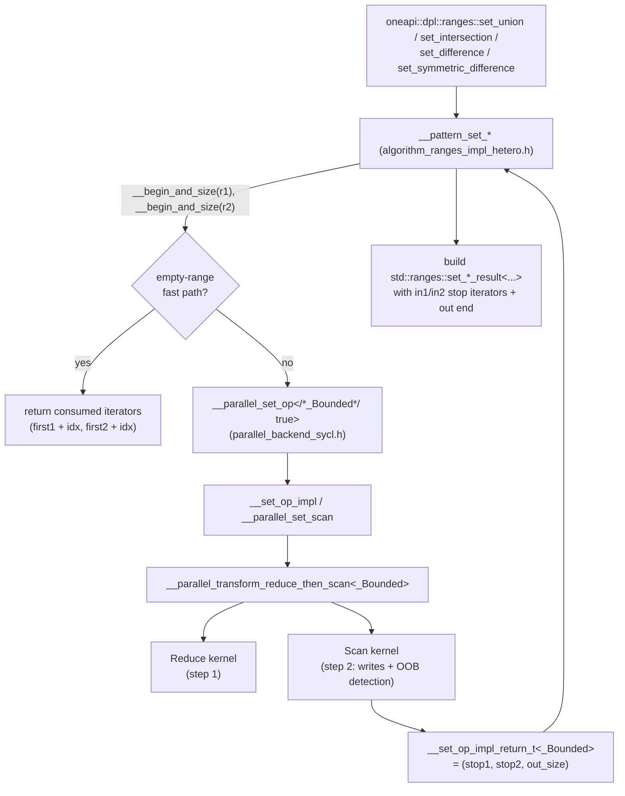
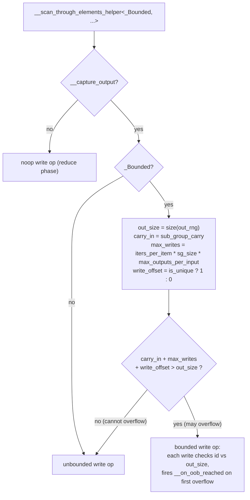
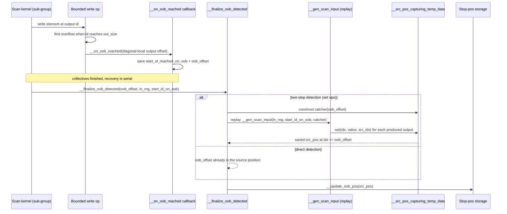
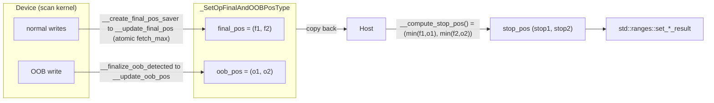
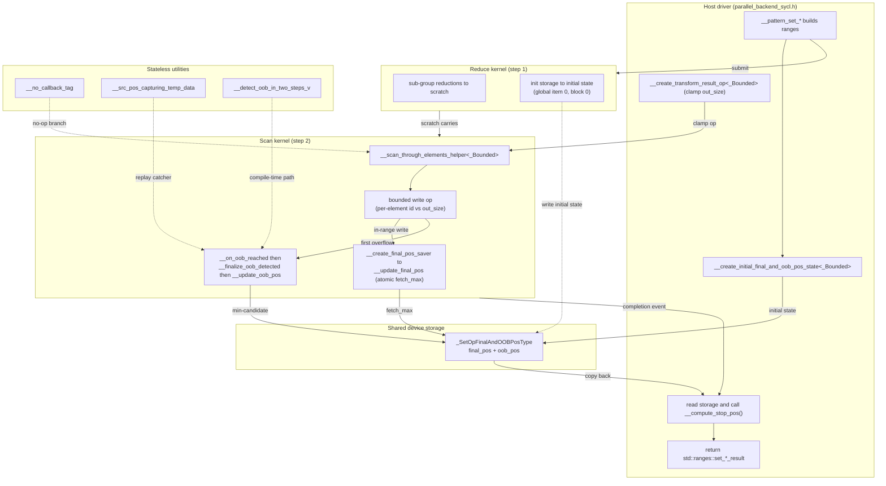

# Bounded Output Support for Heterogeneous Range-Based Set Algorithms

This document describes the mechanisms introduced/affected by the PR that adds proper **bounded
output** support to the `oneapi::dpl::ranges::set_*` algorithms (`set_union`, `set_intersection`,
`set_difference`, `set_symmetric_difference`) when executed with **hetero (SYCL) policies**.

The core problem: a range-based set algorithm must stop writing once the **output range** is full and
return the **stop positions** in both source ranges (i.e. how many input elements were actually
consumed). On the device this requires detecting an out-of-bounds (OOB) write, recovering the
corresponding source position, and reconciling it with the natural final position of the operation.

---

## 1. High-level call chain

How a public range-based set algorithm reaches the reduce-then-scan kernels.

**Key idea:** the `_Bounded` non-type template parameter is threaded from the public pattern all the
way down into the kernel submitters. When `_Bounded == false` the whole stop-position machinery
compiles away to a single `std::size_t` result (no overhead for the unbounded code paths).

---

## 2. Bounded write-path decision (per sub-group)

`__scan_through_elements_helper` decides at runtime whether a sub-group may write freely (fast path)
or must go through the bounded write op that checks every write against the output size.

> **Underflow note.** The guard is written as `carry_in + max_writes + write_offset > out_size`
> rather than `carry_in + max_writes > out_size - write_offset`. With unsigned arithmetic the latter
> underflows (wraps to a huge value) when `out_size < write_offset` -- e.g. `out_size == 0`, or
> `out_size == 1` for unique patterns -- and would incorrectly select the unbounded (fast) path.

---

## 3. Two-step OOB detection and source-position recovery

Set operations run on a *balanced-path* partition: a sub-group consumes a diagonal of the merge
matrix, so the output index where the range fills up does **not** map directly to a source position.
Recovering it with sub-group collectives would be expensive, so we recover it in a cheap **second
serial pass** that replays only the single offending diagonal.

`__detect_oob_in_two_steps_v<_GenScanInput>` selects between the two branches at compile time:
`__gen_set_op_from_known_balanced_path` enables the replay path; all other generators map the OOB
offset to the source position directly.

---

## 4. Stop-position storage and host-side finalization

Two independent positions are tracked per source range and combined on the host.

| Field        | Initial value          | How it is updated                                   | Meaning                                            |
|--------------|------------------------|-----------------------------------------------------|----------------------------------------------------|
| `final_pos`  | `{0, 0}`               | device, atomic `fetch_max` per work-group           | furthest source position the operation consumed    |
| `oob_pos`    | `{size1, size2}`       | device, single writer on first overflow             | source position where the output range filled up   |
| stop (host)  | --                     | `min(final_pos, oob_pos)` element-wise              | actual returned stop position in each source range |

The `min` reconciliation is what makes the result correct in both regimes:

- **Output large enough:** no OOB occurs, `oob_pos` stays at `{size1, size2}`, so the stop position is
  the natural `final_pos`.
- **Output too small:** `oob_pos` records where writing stopped; it is `<= final_pos`, so it wins the
  `min` and becomes the reported stop position.

---

## 5. Supporting utilities introduced by the PR

| Symbol | File | Role |
|---|---|---|
| `__no_callback_tag`, `__is_no_callback_v` | `utils.h` | No-op placeholder so kernel helpers can branch on absent callbacks via `if constexpr`. |
| `__begin_and_size` | `utils_ranges.h` | Returns `(begin, size)` together for concise pattern code. |
| `_SetOpFinalAndOOBPosType`, `__compute_stop_pos` | `utils_ranges_sycl.h` | Device-copyable storage holding `final_pos` + `oob_pos` and computing their `min`. |
| `__create_initial_final_and_oob_pos_state<_Bounded>` | `utils_ranges_sycl.h` | Initializes storage (`{0,0}` / `{size1,size2}`); collapses to `size_t{0}` when unbounded. |
| `__create_transform_result_op<_Bounded>` / `__clamp_max` | `utils_ranges_sycl.h` | Clamps the reported output size to the output range capacity. |
| `__src_pos_capturing_temp_data` | `parallel_backend_sycl_reduce_then_scan.h` | Temp-data stand-in that captures the source position at a target diagonal-local offset. |
| `__finalize_oob_detected`, `__create_on_oob_reached`, `__create_final_pos_saver` | `parallel_backend_sycl_reduce_then_scan.h` | OOB recovery, OOB callback, and final-position saver. |
| `__device_storage::type`, `__result_storage::type` | `parallel_backend_sycl_utils.h` | Expose storage element type for the stop-position traits. |

---

## 6. Component interaction map

End-to-end view of how the host driver, the two device kernels, the shared stop-position storage and
the supporting utilities interact during one bounded set operation.

**How to read it.** Solid arrows are data/control flow during execution. Dashed arrows show
compile-time wiring or no-op placeholders that collapse away when `_Bounded == false`. The single
`_SetOpFinalAndOOBPosType` instance is the only shared mutable state between the kernels and the host:
the reduce kernel seeds it, the scan kernel updates `final_pos` (many writers, `fetch_max`) and
`oob_pos` (one writer), and the host reduces both into the returned stop positions.

---

*Rendered by GitHub: the Mermaid diagrams above display natively in the PR description, PR comments,
and any committed .md file.*
