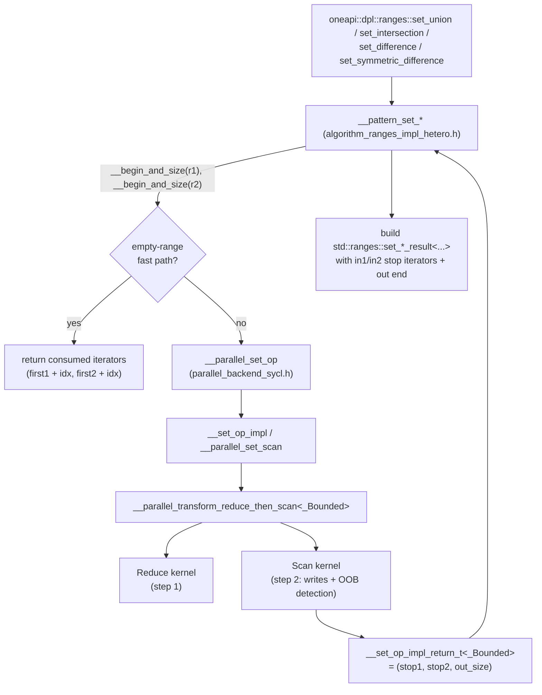
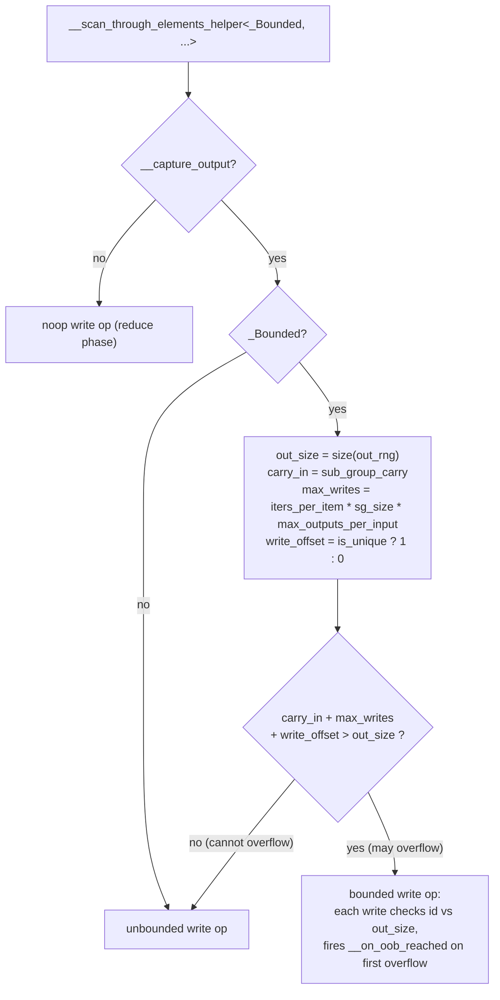
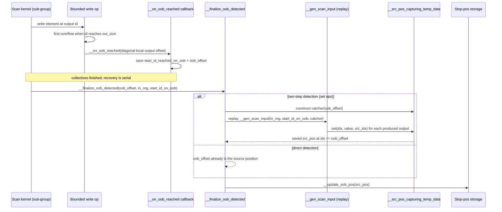
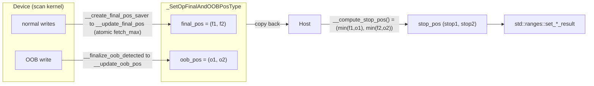
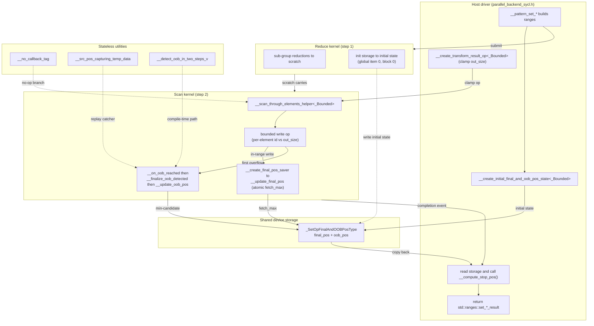

### **ATTENTION** for now the changes from this PR includes all changes from https://github.com/uxlfoundation/oneDPL/pull/2657 !!!

Merge plan:
1) merge https://github.com/uxlfoundation/oneDPL/pull/2657
2) than merge this PR

### What has been done in this PR
- implemented `set`-operations from `oneapi::dpl::ranges` namespace for bounded output (for hetero-policies);
- implemented the proper evaluation of stop positions in input ranges for `set`-operations from `oneapi::dpl::ranges` namespace (for hetero-policies).

### Summary
This PR implements full heterogeneous (SYCL device) backend support for the four range-based set algorithms from oneapi::dpl::ranges — `set_union`, `set_intersection`, `set_difference`, and `set_symmetric_difference` — when the output range is bounded (smaller than the full merge result). It correctly computes and returns stop positions in all three ranges (both input ranges and the output range), matching the semantics of `std::ranges::set_*` return types.
This PR is based on top of #2657 and should be merged after it.

### Motivation
Previously, range-based set algorithms with hetero policies were either completely disabled for bounded output (`ONEDPL_SET_RANGE_ALGS_CPP26_LIKE` guard) or returned incorrect stop positions (e.g., always returning `first1 + n1` and `first2 + n2` regardless of how much of the input was actually consumed). This violated the `std::ranges` contract, which requires that the returned iterators point to the first unconsumed element in each range.

### Changed files
Production code:
- [include/oneapi/dpl/pstl/hetero/algorithm_impl_hetero.h](https://github.com/uxlfoundation/oneDPL/pull/2721/files#diff-de507d174f2c00af6dfa912535ca543d73c6e76bf62ecf8daebfcb9293d2c904)
- [include/oneapi/dpl/pstl/hetero/algorithm_ranges_impl_hetero.h](https://github.com/uxlfoundation/oneDPL/pull/2721/files#diff-a84943eda340681156c532d7dcf0e29beae0347e2c4bb24e84a26e54bb10d6aa)
- [include/oneapi/dpl/pstl/hetero/dpcpp/parallel_backend_sycl.h](https://github.com/uxlfoundation/oneDPL/pull/2721/files#diff-2ca361b25a7a034ababc7d315f64f4e7fd71be8cd35057bef5a8e03a83d12f7c)
- [include/oneapi/dpl/pstl/hetero/dpcpp/parallel_backend_sycl_reduce_then_scan.h](https://github.com/uxlfoundation/oneDPL/pull/2721/files#diff-2a9d7e3da31b3337d1f36fa11886b4cd1340189adc72dd4ae294b7067b734d91)
- [include/oneapi/dpl/pstl/hetero/dpcpp/parallel_backend_sycl_utils.h](https://github.com/uxlfoundation/oneDPL/pull/2721/files#diff-940a2c0959e1b575e4cbfe8393dc38cc610f6cb15149a39aae73b0fc18f72c28)
- [include/oneapi/dpl/pstl/hetero/dpcpp/utils_ranges_sycl.h](https://github.com/uxlfoundation/oneDPL/pull/2721/files#diff-b240d6dc11eec9d0fe3a00e10f8506df39d3c09420d093c9c18a184f129a4438)
- [include/oneapi/dpl/pstl/utils.h](https://github.com/uxlfoundation/oneDPL/pull/2721/files#diff-145498a92180a9996c52c9ed276e2f26cad8868fcc226b8cecb812cffd3c119c)
- [include/oneapi/dpl/pstl/utils_ranges.h](https://github.com/uxlfoundation/oneDPL/pull/2721/files#diff-3466e4b4af77a04dea625d86b743100d72f7fd5b0d31fb618783e64ada3bb791)

Tests:
- [test/general/implementation_details/balanced_path_unit_tests.pass.cpp](https://github.com/uxlfoundation/oneDPL/pull/2721/files#diff-d4062cccc7813b4544c277b98c790f75409751694d446535e79f84a8f20fc2bf)
- [test/parallel_api/ranges/std_ranges_set_difference.pass.cpp](https://github.com/uxlfoundation/oneDPL/pull/2721/files#diff-b243b22621680674692daaf092bf149afb3e798cc19edcaa340e6589991ff167)
- [test/parallel_api/ranges/std_ranges_set_intersection.pass.cpp](https://github.com/uxlfoundation/oneDPL/pull/2721/files#diff-534e55f1856f600d740afd4b9ee3477407f1914bd077fa0678f1561438aa5b2c)
- [test/parallel_api/ranges/std_ranges_set_symmetric_difference.pass.cpp](https://github.com/uxlfoundation/oneDPL/pull/2721/files#diff-783066c14509f5f9a3617b749db1dadb9ce0227538d816e224a0b1c0132e0c43)
- [test/parallel_api/ranges/std_ranges_set_union.pass.cpp](https://github.com/uxlfoundation/oneDPL/pull/2721/files#diff-41827d13cd05d6fa096333af825347250de735f7bb4a6085a4ea217b2708f225)
- [test/parallel_api/ranges/std_ranges_test.h](https://github.com/uxlfoundation/oneDPL/pull/2721/files#diff-56620027842b8469f6bd212575e05bfa7a8e8a363785909d51125b31ba103029)
- [test/support/test_config.h](https://github.com/uxlfoundation/oneDPL/pull/2721/files#diff-d96b6ea8eddec6ed0f860b2658df3af0306f3583917866e78ec8d54f8703f986)

What has been done

#### Core algorithm layer ([algorithm_ranges_impl_hetero.h](https://github.com/uxlfoundation/oneDPL/pull/2721/files#diff-a84943eda340681156c532d7dcf0e29beae0347e2c4bb24e84a26e54bb10d6aa))
- Removed all `#if ONEDPL_SET_RANGE_ALGS_CPP26_LIKE` … `static_assert(false)` … `#endif` guards.
- All four set operations now call `__parallel_set_op` and destructure the result into `(__stop1, __stop2, __stop3)` — the consumed-element counts in each of the three ranges.
- Fixed previously incorrect stop-position computations for the one-empty-range fast paths (e.g. `{__first1, __first2 + __idx, __result + __idx}` instead of erroneously using `__n2`).

#### Backend dispatch ([parallel_backend_sycl.h](https://github.com/uxlfoundation/oneDPL/pull/2721/files#diff-2ca361b25a7a034ababc7d315f64f4e7fd71be8cd35057bef5a8e03a83d12f7c))
- Added `bool _Bounded` template parameter to `__parallel_set_write_a_b_op`, `__parallel_set_scan`, `__set_op_impl`, and `__parallel_set_op`.
- `__parallel_set_op` now waits for the kernel, reads back stop-position data from device memory, and returns a triple `(stop_pos1, stop_pos2, stop_pos3)` when `_Bounded = true`, or a single `std::size_t` result when `_Bounded = false`.
- Replaced the ad-hoc `__clamp_max` + lambda result transformer with a reusable `__create_transform_result_op<_Bounded>()` helper (moved to [utils_ranges_sycl.h](https://github.com/uxlfoundation/oneDPL/pull/2721/files#diff-b240d6dc11eec9d0fe3a00e10f8506df39d3c09420d093c9c18a184f129a4438)).
- Fixed `__parallel_reduce_then_scan_copy`: internal scan/reduction counters now use caller-supplied `_Size` (the input range difference type) instead of `_OutRngSize`, preventing potential overflow when the output range has a narrower difference_type.

#### Reduce-then-scan kernel infrastructure ([parallel_backend_sycl_reduce_then_scan.h](https://github.com/uxlfoundation/oneDPL/pull/2721/files#diff-2a9d7e3da31b3337d1f36fa11886b4cd1340189adc72dd4ae294b7067b734d91))
This is the main engine change. Several new capabilities were added:
- `__src_pos_capturing_temp_data<_SrcDataPosT>` — a drop-in replacement for `_TempData` used during the second pass of `OOB` detection for set operations. Instead of storing output values, it captures the `(idx1, idx2)` source pair at a specific diagonal-local output index, allowing recovery of the source position without re-running sub-group collective operations.
- `__max_outputs_per_input` constant added to `__temp_data_array` and `__noop_temp_data` — used to correctly bound the maximum number of writes a sub-group can produce per scanned element, enabling the bounded-write fast-path check to work correctly for set operations (which can emit up to diagonal_size outputs per diagonal).
- Two-step `OOB` detection for set operations (`__detect_oob_in_two_steps_v`): When `OOB` is detected during the scan phase, only the diagonal index and the diagonal-local output offset are stored (as a `std::uint16_t`). A second pass then re-runs the serial set operation for that diagonal using `__src_pos_capturing_temp_data` to recover the exact `(idx1, idx2)` source position without any sub-group communication.
- Final-position tracking (`_FinalPosSaver` callback, `__create_final_pos_saver`): For set operations, each work-item tracks the furthest processed source-index pair via a work-group `fetch_max` reduction into global memory. This records the "all-consumed" stop position for when the output is not exhausted.
- `_SetOpFinalAndOOBPosType` (in [utils_ranges_sycl.h](https://github.com/uxlfoundation/oneDPL/pull/2721/files#diff-b240d6dc11eec9d0fe3a00e10f8506df39d3c09420d093c9c18a184f129a4438)): A device-copyable struct holding both the final position and the `OOB` position in source ranges. On the host, `__compute_stop_pos()` takes the element-wise min of final and OOB to produce the true stop position.
- `__transform_reduce_then_scan_result_t` generalized: the third tuple element now carries `_StopPosInitState` (a caller-specified type) rather than the output range's difference type, allowing it to hold `_SetOpFinalAndOOBPosType` for set operations.
- Bounded fast-path underflow fix: The condition `__carry_in + __max_writes > __out_rng_size - __write_output_offset` was rewritten as `__carry_in + __max_writes + __write_output_offset > __out_rng_size` to eliminate unsigned underflow when `__out_rng_size` is `0` or `1`.
- `__start_id_reached tracking`: `__scan_through_elements_helper_impl` now updates a reference parameter on every `__gen_input` call, recording the diagonal index at the moment `OOB` was detected.
- Renamed `__no_oob_pos_acc_tag` / `__create_oob_pos_storage_opt` to `__no_stop_pos_acc_tag` / `__get_stop_pos_accessor_opt` to better reflect that the storage now carries both final and OOB positions.

#### Supporting utilities
- [utils_ranges_sycl.h](https://github.com/uxlfoundation/oneDPL/pull/2721/files#diff-b240d6dc11eec9d0fe3a00e10f8506df39d3c09420d093c9c18a184f129a4438): Added `_SetOpFinalAndOOBPosType`, `__final_pos_type_selector`, `__create_initial_final_and_oob_pos_state`, `__create_transform_result_op`, `__set_op_impl_return_t`, `__create_set_op_impl_result`, `__clamp_max`; added `#include <algorithm>` for `std::min`.
- [utils.h](https://github.com/uxlfoundation/oneDPL/pull/2721/files#diff-145498a92180a9996c52c9ed276e2f26cad8868fcc226b8cecb812cffd3c119c): Added `__no_callback_tag` and `__is_no_callback_v` — a tag/trait for distinguishing real callbacks from no-ops in if constexpr branches.
- [utils_ranges.h](https://github.com/uxlfoundation/oneDPL/pull/2721/files#diff-3466e4b4af77a04dea625d86b743100d72f7fd5b0d31fb618783e64ada3bb791): Added `__begin_and_size()` helper.
- [parallel_backend_sycl_utils.h](https://github.com/uxlfoundation/oneDPL/pull/2721/files#diff-940a2c0959e1b575e4cbfe8393dc38cc610f6cb15149a39aae73b0fc18f72c28): Added `using type = _T` to `__device_storage` and `__result_storage` for `_StopPosStorage::type` trait access.

#### Tests
- Removed all temporary workarounds: `STD_RANGES_SET_OP_BROKEN_FOR_HETERO_POLICY`, `skip_test_for_hetero_policy`, `ResolveTestDataModeForHeteroPolicy`, and their associated TODO comments from all four set-operation test files ([set_union](https://github.com/uxlfoundation/oneDPL/pull/2721/files#diff-41827d13cd05d6fa096333af825347250de735f7bb4a6085a4ea217b2708f225), [set_intersection](https://github.com/uxlfoundation/oneDPL/pull/2721/files#diff-534e55f1856f600d740afd4b9ee3477407f1914bd077fa0678f1561438aa5b2c), [set_difference](https://github.com/uxlfoundation/oneDPL/pull/2721/files#diff-b243b22621680674692daaf092bf149afb3e798cc19edcaa340e6589991ff167), [set_symmetric_difference](https://github.com/uxlfoundation/oneDPL/pull/2721/files#diff-783066c14509f5f9a3617b749db1dadb9ce0227538d816e224a0b1c0132e0c43)) and [std_ranges_test.h](https://github.com/uxlfoundation/oneDPL/pull/2721/files#diff-56620027842b8469f6bd212575e05bfa7a8e8a363785909d51125b31ba103029); the `STD_RANGES_SET_OP_BROKEN_FOR_HETERO_POLICY` macro itself was dropped from [test_config.h](https://github.com/uxlfoundation/oneDPL/pull/2721/files#diff-d96b6ea8eddec6ed0f860b2658df3af0306f3583917866e78ec8d54f8703f986).
- Updated the serial set-op helper calls in [balanced_path_unit_tests.pass.cpp](https://github.com/uxlfoundation/oneDPL/pull/2721/files#diff-d4062cccc7813b4544c277b98c790f75409751694d446535e79f84a8f20fc2bf) to pass `__no_callback_tag{}`.
- The full `data_in_in_out_lim` test mode (bounded output) is now exercised on device for all four set operations.

Schema of Bounded Output Support for Heterogeneous Range-Based Set Algorithms
## 1. High-level call chain

How a public range-based set algorithm reaches the reduce-then-scan kernels.

**Key idea:** the `_Bounded` non-type template parameter is threaded from the public pattern all the
way down into the kernel submitters. When `_Bounded == false` the whole stop-position machinery
compiles away to a single `std::size_t` result (no overhead for the unbounded code paths).

---

## 2. Bounded write-path decision (per sub-group)

`__scan_through_elements_helper` decides at runtime whether a sub-group may write freely (fast path)
or must go through the bounded write op that checks every write against the output size.

> **Underflow note.** The guard is written as `carry_in + max_writes + write_offset > out_size`
> rather than `carry_in + max_writes > out_size - write_offset`. With unsigned arithmetic the latter
> underflows (wraps to a huge value) when `out_size < write_offset` -- e.g. `out_size == 0`, or
> `out_size == 1` for unique patterns -- and would incorrectly select the unbounded (fast) path.

---

## 3. Two-step OOB detection and source-position recovery

Set operations run on a *balanced-path* partition: a sub-group consumes a diagonal of the merge
matrix, so the output index where the range fills up does **not** map directly to a source position.
Recovering it with sub-group collectives would be expensive, so we recover it in a cheap **second
serial pass** that replays only the single offending diagonal.

`__detect_oob_in_two_steps_v<_GenScanInput>` selects between the two branches at compile time:
`__gen_set_op_from_known_balanced_path` enables the replay path; all other generators map the OOB
offset to the source position directly.

---

## 4. Stop-position storage and host-side finalization

Two independent positions are tracked per source range and combined on the host.

| Field        | Initial value          | How it is updated                                   | Meaning                                            |
|--------------|------------------------|-----------------------------------------------------|----------------------------------------------------|
| `final_pos`  | `{0, 0}`               | device, atomic `fetch_max` per work-group           | furthest source position the operation consumed    |
| `oob_pos`    | `{size1, size2}`       | device, single writer on first overflow             | source position where the output range filled up   |
| stop (host)  | --                     | `min(final_pos, oob_pos)` element-wise              | actual returned stop position in each source range |

The `min` reconciliation is what makes the result correct in both regimes:

- **Output large enough:** no OOB occurs, `oob_pos` stays at `{size1, size2}`, so the stop position is
  the natural `final_pos`.
- **Output too small:** `oob_pos` records where writing stopped; it is `<= final_pos`, so it wins the
  `min` and becomes the reported stop position.

---

## 5. Supporting utilities introduced by the PR

| Symbol | File | Role |
|---|---|---|
| `__no_callback_tag`, `__is_no_callback_v` | [utils.h](https://github.com/uxlfoundation/oneDPL/pull/2721/files#diff-145498a92180a9996c52c9ed276e2f26cad8868fcc226b8cecb812cffd3c119c) | No-op placeholder so kernel helpers can branch on absent callbacks via `if constexpr`. |
| `__begin_and_size` | [utils_ranges.h](https://github.com/uxlfoundation/oneDPL/pull/2721/files#diff-3466e4b4af77a04dea625d86b743100d72f7fd5b0d31fb618783e64ada3bb791) | Returns `(begin, size)` together for concise pattern code. |
| `_SetOpFinalAndOOBPosType`, `__compute_stop_pos` | [utils_ranges_sycl.h](https://github.com/uxlfoundation/oneDPL/pull/2721/files#diff-b240d6dc11eec9d0fe3a00e10f8506df39d3c09420d093c9c18a184f129a4438) | Device-copyable storage holding `final_pos` + `oob_pos` and computing their `min`. |
| `__create_initial_final_and_oob_pos_state<_Bounded>` | [utils_ranges_sycl.h](https://github.com/uxlfoundation/oneDPL/pull/2721/files#diff-b240d6dc11eec9d0fe3a00e10f8506df39d3c09420d093c9c18a184f129a4438) | Initializes storage (`{0,0}` / `{size1,size2}`); collapses to `size_t{0}` when unbounded. |
| `__create_transform_result_op<_Bounded>` / `__clamp_max` | [utils_ranges_sycl.h](https://github.com/uxlfoundation/oneDPL/pull/2721/files#diff-b240d6dc11eec9d0fe3a00e10f8506df39d3c09420d093c9c18a184f129a4438) | Clamps the reported output size to the output range capacity. |
| `__src_pos_capturing_temp_data` | [parallel_backend_sycl_reduce_then_scan.h](https://github.com/uxlfoundation/oneDPL/pull/2721/files#diff-2a9d7e3da31b3337d1f36fa11886b4cd1340189adc72dd4ae294b7067b734d91) | Temp-data stand-in that captures the source position at a target diagonal-local offset. |
| `__finalize_oob_detected`, `__create_on_oob_reached`, `__create_final_pos_saver` | [parallel_backend_sycl_reduce_then_scan.h](https://github.com/uxlfoundation/oneDPL/pull/2721/files#diff-2a9d7e3da31b3337d1f36fa11886b4cd1340189adc72dd4ae294b7067b734d91) | OOB recovery, OOB callback, and final-position saver. |
| `__device_storage::type`, `__result_storage::type` | [parallel_backend_sycl_utils.h](https://github.com/uxlfoundation/oneDPL/pull/2721/files#diff-940a2c0959e1b575e4cbfe8393dc38cc610f6cb15149a39aae73b0fc18f72c28) | Expose storage element type for the stop-position traits. |

---

## 6. Component interaction map

End-to-end view of how the host driver, the two device kernels, the shared stop-position storage and
the supporting utilities interact during one bounded set operation.

**How to read it.** Solid arrows are data/control flow during execution. Dashed arrows show
compile-time wiring or no-op placeholders that collapse away when `_Bounded == false`. The single
`_SetOpFinalAndOOBPosType` instance is the only shared mutable state between the kernels and the host:
the reduce kernel seeds it, the scan kernel updates `final_pos` (many writers, `fetch_max`) and
`oob_pos` (one writer), and the host reduces both into the returned stop positions.
