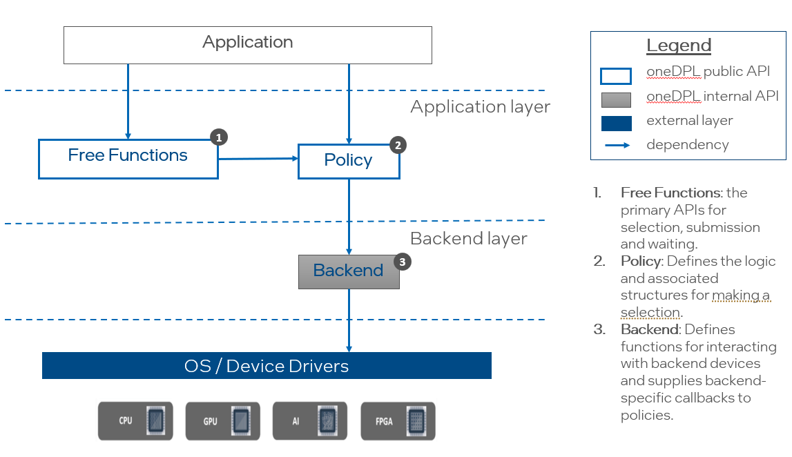
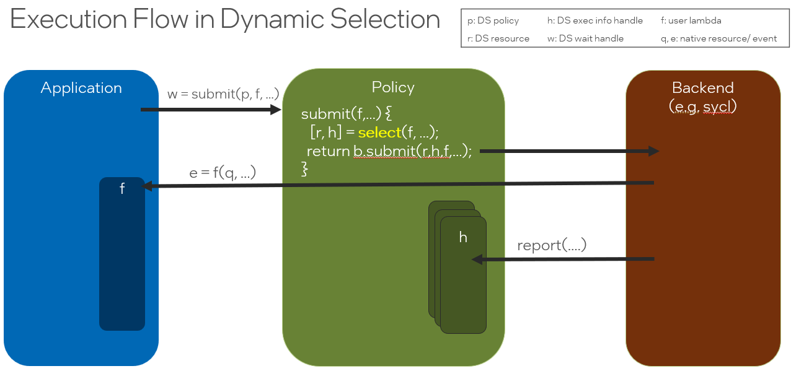

# Dynamic Device Selection API

## Introduction

Dynamic Selection is a Technology Preview feature 
[documented in the oneDPL Developer Guide](https://www.intel.com/content/www/us/en/docs/onedpl/developer-guide/2022-8/dynamic-selection-api.html).
Dynamic selection provides functions for choosing a resource using a *selection policy*. 
By default, the *resources* selected via Dynamic Selection APIs are SYCL queues. Since the
API itself is documented in the oneDPL Developer Guide that information will not
be repeated here excepted where necessary. It is assumed that readers of this document
are familiar with the API documentation.

This document contains the following:
- An overview of the current architecture and design.
- Exit criteria for moving from experimental to fully supported or, if these goals are not achieved in
a timely manner, for justifying removal of the feature.

## Overview of Architecture and Execution Flow

The key components of the Dynamic Selection API are shown below, including the
[Free Functions](#free_functions_id) (such as `submit`, `select`, `wait`, etc), a
[Policy](#policy_req_id) object (such as [fixed_resource_policy](#concrete_policies_id),
[round_robin_policy](#concrete_policies_id), [dynamic_load_policy](#concrete_policies_id) and
[auto_tune_policy](#concrete_policies_id)) and a [Backend](#backend_req_id) object (currently only
`sycl_backend`). Users interact with Dynamic Selection through the [Free Functions](#free_functions_id)
and their chosen [Policy](#policy_req_id). The [Free Functions](#free_functions_id) have
default implementations that depend on a limited set of required functions in the
[Policy](#policy_req_id). Optional functions may be defined by a [Policy](#policy_req_id)
to customize some of the Free Functions, such as `submit_and_wait` that would, by default,
depend on multiple basis functions. Resource specific instrumentation and types are defined
in the [Backend](#backend_req_id).



The following code example shows some of the key aspects of the API. The use of any empty
`single_task` is for syntactic demonstration purposes only; any valid command group or series
of command groups can be submitted to the selected queue.

```cpp
  #include <oneapi/dpl/dynamic_selection>
  #include <sycl/sycl.hpp>
  #include <iostream>

  namespace ex = oneapi::dpl::experimental;

  int main() {

    // (1) create a policy object
    ex::dynamic_load_policy p{ { sycl::queue{ sycl::cpu_selector_v },
                                 sycl::queue{ sycl::gpu_selector_v } } };

    for (int i = 0; i < 6; ++i) {

      // (2) call one of the dynamic selection functions
      //     -- pass the policy to the API function
      //     -- provide a function to be called with a selected queue
      //        -- the user function must receive a sycl queue
      //        -- the user function must return a sycl event
      auto done = ex::submit(p,
                            // (3) use the selected queue in user function
                            [=](sycl::queue q) {
                              std::cout << "submit task to "
                                        << ((q.get_device().is_gpu()) ? "gpu\n" : "cpu\n");
                              return q.single_task([]() { /* work here */ });
                            });

      // (4) each submission can be waited on using the returned object
      ex::wait(done);
    }

    // (5) and/or all submissions can be waited on as a group
    //     in a typical case one would use (4) or (5) but not both.
    ex::wait(p.get_submission_group());
  }
```

The execution flow of a call to the function ``ex::submit`` is shown below.  



The free function `submit` receives a [Policy](#policy_req_id) object `p` and
a function object `f` and returns an object `w` that can be waited on.
A valid [Policy](#policy_req_id) must define a `submit` member function and a
[Backend](#backend_req_id) must also define a `submit` member function. The
requirements on [Policy](#policy_req_id) and [Backend](#backend_req_id) types
are discussed later in this proposal. In the figure, the Policy's `submit` function
selects a resource `r` and then passes `r`, an execution info handle `h`, and `f`
to the Backend. The handle `h` is the mechanism for the Backend to report runtime
information required by the Policy logic for making future selections, such as
the execution time of a task when run on a specific resource.

The [Backend](#backend_req_id) `submit` function invokes `f` with the selected
resource as an argument and is also responsible for collecting and reporting
any information required by the [Policy](#policy_req_id). The
[Execution Info](#execution_info_id) section of this document describes how
to use traits to determine what information needs to be reported. 

## Named Requirements

<a id="policy_req_id"></a>
### Policy

A Policy is an object with a valid dynamic selection heuristic.

The type `T` satisfies *Policy* if given,

- `p` an arbitrary identifier of type `T`
- `args` an arbitrary parameter pack of types `typename… Args`
- `s` a selection of a type `selection_t<T>` , which satisfies [Selection](#selection_req_id), and was made by `p`.
- `f` a function object with signature `wait_t<T> fun(resource_t<T>, Args…);`

| *Must* be well-formed | Description |
| --------------------- | ----------- |
| `p.get_resources()` | Returns a `std::vector<resource_t<T>>`. |
| `p.select(args…)` | Returns `selection_t<T>` that satisfies [Selection](#selection_req_id). The selected resource must be within the set of resources returned by `p.get_resources()`. |
| `p.submit(s, f, args…)` | Returns `submission_t<T>` that satisfies [Submission](#submission_req_id). The function invokes `f` with the selected resource `s` and the arguments `args...`. |

| *Optional* | Description |
| --------------------- | ----------- |
| `p.submit_and_wait(s, f, args…)` | Returns `void`. The function invokes `f` with `s` and `args...` and waits for the `wait_t<T>` it returns to complete. |
| `p.submit(f, args…)` | Returns `submission_t<T>` that satisfies [Submission](#submission_req_id). The function selects a resource and invokes `f` with the selected resource and `args...`. |
| `p.submit_and_wait(f, args…)` | Returns `void`. The function selects a resource, invokes `f` and waits for the `wait_t<T>` it returns to complete. |

| Policy Traits* | Description |
| ------- | ----------- |
| `policy_traits<T>::selection_type`, `selection_t<T>` | The wrapped select type returned by `T`. Must satisfy [Selection](#selection_req_id). |
| `policy_traits<T>::resource_type`, `resource_t<T>` | The backend defined resource type that is passed to the user function object. Calling `unwrap` an object of type `selection_t<T>` returns an object of type `resource_t<T>`. |
| `policy_traits<T>::wait_type`, `wait_type_t<T>` | The backend type that is returned by the user function object. Calling `unwrap` on an object that satisfies [Submission](#submission_req_id) returns on object of type `wait_type_t<T>`. |

The default implementation of these traits depends on types defined in the Policy:

```cpp
  template <typename Policy>
  struct policy_traits
  {
      using selection_type = typename std::decay_t<Policy>::selection_type;
      using resource_type = typename std::decay_t<Policy>::resource_type;
      using wait_type = typename std::decay_t<Policy>::wait_type;
  };
```

<a id="selection_req_id"></a>
### Selection

The type `T` satisfies *Selection* for a given [Policy](#policy_req_id) `p` if given,

- `s` an arbitrary identifier of type `T`
- `i` an object of type `Info` where `execution_info_v<Info>` is `true`
- 'v' an object of type `Info::value_type`

| *Must* be well-formed | Description |
| --------------------- | ----------- |
| `s.unwrap()` | Returns `resource_t<T>` that should represent one of the resources returned by `p.get_resources()` for the Policy `p` that generated `s`. |
| `s.get_policy()` | Returns the Policy `p` that was used to make the selection. |
| `s.report(i)` | Returns `void`. Notifies policy that an execution info event has occurred. |
| `s.report(i, v)` | Returns `void`. Notifies policy of a new value `v` for execution info event `i`. |
| `report_execution_info<T, Info>::value`, `report_execution_info_v<T,Info>` | `true` if this selection needs the backend to report the Info. `false` otherwise. |

<a id="submission_req_id"></a>
### Submission

The type `T` satisfies *Submission* for a given [Policy](#policy_req_id) `p` if given,

- `s` an arbitrary identifier of type `T`

| *Must* be well-formed | Description |
| --------------------- | ----------- |
| `s.wait()` | Blocks until the submission has completed. |
| `s.unwrap()` | Returns the underlying backend type value. This type may be void, may represent the backend’s synchronization type, or may represent a return value from the submission. |

<a id="concrete_policies_id"></a>
## Provided Concrete Policies 

The following concrete policies are provided in the experimental implementation. Their details can be found in
[the oneDPL Developer Guide](https://www.intel.com/content/www/us/en/docs/onedpl/developer-guide/2022-8/dynamic-selection-api.html).

| Available Policies |
| ------------------------|
| [`fixed_resource_policy`](https://www.intel.com/content/www/us/en/docs/onedpl/developer-guide/2022-8/fixed-resource-policy.html) |
| [`round_robin_policy`](https://www.intel.com/content/www/us/en/docs/onedpl/developer-guide/2022-8/round-robin-policy.html) |
| [`dynamic_load_policy`](https://www.intel.com/content/www/us/en/docs/onedpl/developer-guide/2022-8/dynamic-load-policy.html) |
| [`auto_tune_policy`](https://www.intel.com/content/www/us/en/docs/onedpl/developer-guide/2022-8/auto-tune-policy.html) |

<a id="backend_req_id"></a>
## Backends

Backends allow generic policies to be implemented. Application developers do not directly
interact with a backend, except to choose the backend if they opt-out of the default SYCL backend.
Custom policy writers that wish to implement a generic policy that can accept backends
should follow the backend contract. Developers that wish to provide a backend that can
be used with the existing concrete policies should also follow the backend contract.

### Named Requirements

The type `T` satisfies the *Backend* contract if given,

- `b` an arbitrary identifier of type `T`
- `args` an arbitrary parameter pack of types `typename… Args`
- `s` is of type `S` and satisfies *Selection* and `is_same_v<resource_t<S>, resource_t<T>>` is `true`
- `f` a function object with signature `wait_t<T> fun(resource_t<T>, Args…);`

| *Must* be well-formed | Description |
| --------------------- | ----------- |
| `b.submit(s, f, args…)` | Returns an object that satisfies *Submission*. The function invokes `f` but does not wait for the `wait_t<T>` object returned by it. |
| `b.get_submission_group()` | Returns an object that has a member function `void wait()`. Calling this wait function blocks until all previous submissions to this backend are complete. |
| `b.get_resources()` | Returns a `std::vector<resource_t<T>>`. |

| *Optional* | Description |
| --------------------- | ----------- |
| `void lazy_report()` | If defined by a backend, this function must be called by a policy before each new selection. It triggers reporting of the necessary execution info back to the policy. |

<a id="free_functions_id"></a>
## Free Functions

| Signature | Description |
| --------- | ----------- |
| `vector<typename policy_traits<P>::resource_type> get_resources(P&& p);` | Returns the resources associated with the Policy `p`. |
| `template<typename P, typename... Args> selection_t<P> select(P&& p, Args&&... args);` | Applies the policy `p` and returns a *Selection*. |
| `template<Selection S, typename F, typename... Args> auto submit(Selection s, F&& f, Args&&... args);` | Invokes `f` with the unwrapped resource from selection `s` and `args`. Implements any instrumentation necessary for the backend to report necessary execution information. May be implemented as `s.get_policy().submit(s, f, args…)`. |
| `template<Policy P, typename F, typename... Args> auto submit(P&& p, F&& f, Args&&... args);` | Invokes `f` with the unwrapped resource returned by `select(p, f, args…)` and `args`. Implements any instrumentation necessary for the backend to report necessary execution information. May be implemented as `p.submit(p.select(p, f, args…), f, args…)`. |
| `template<Selection S, typename F, typename... Args> auto submit_and_wait(Selection s, F&& f, Args&&... args);` | Invokes `f` with the unwrapped resource from selection `s` and `args`. And then waits on object returned by the `f`.  May be implemented as `wait(s.get_policy().submit(s, f, args…))`. |
| `template<Policy P, typename F, typename... Args> auto submit_and_wait(P&& p, F&& f, Args&&... args);` |  Invokes `f` with the unwrapped resource returned by `select(p, f, args…)` and `args`.And then waits on object returned by the `f`. May be implemented as `wait(p.submit(p.select(f, args…),f,args…))`. |
| `template<typename P> auto get_submission_group(P&& p);` | Returns an object that has a member function `void wait()`. Calling this wait function blocks until all previous submissions to this policy are complete. |
| `template<typename W> void unwrap(W&& w) noexcept;` | Returns `w.unwrap()` if available, otherwise returns `w`. |
| `template<typename W> void wait(W&& w);` | Calls `w.wait()`. |
| `template <typename S, typename Info> void report(S&& s, const Info& i);` | `S` is a *Selection*. Reports that event `i` has occurred if `s.report(i)` is available. |
| `template <typename S, typename Info, typename Value> void report(S&& s, const Info& i, const Value& v); ` | `S` is a *Selection*. Reports a new value `v` for event `i` if `s.report(i, v)` is available. |

### Deferred Initialization

A call to `get_resources`, `select`, `submit` or `submit_and_wait` may initialize
underlying state variables, including dynamic allocation. Initialization may throw `std::bad_alloc`.
If `p` is a policy constructed with deferred initialization, calling these functions before 
calling `initialize` will throw `std::logic_error`.

<a id="execution_info_id"></a>
## Execution Info

Policies are informed of key events through the reporting of Execution Info.
Most commonly, this reporting is done by a backend and is not visible to the
end user.  However, developers that implement custom backends, or that
manage work submission without using the `submit` or `submit_and_wait` functions,
will need to report Execution Info to allow policies to work properly. There
are currently three kinds of Execution Info that may be required by a Policy:

| Execution Info    | Value Type | Description |
| ----------------- | ---------- | ----------- |
| `task_time`       | `uint64_t` | Clock ticks that elapsed between task submission and completion. |
| `task_submission` | void       | The task has been submitted. |
| `task_completion` | void       | The task is complete |

| Info Traits* | Description |
| ------- | ----------- |
| `report_info<S,Info>::value`, `report_info_v<S,Info>` | 'true' if the *Selection* requires the event type to be reported |
| `report_value<S,Info,V>::value`, `report_info_v<S,Info,V>` | `true` if the *Selection* requires the event value to be reported |

Backend traits can be used to determine what events are need by the *Policy* that provided a *Selection*.
For example, below is code a function the receives a *Selection* and uses traits to determine if the
`task_submission_t` must be reported. If so, it is reported using the `report` free function.

```cpp
    template <typename SelectionHandle, typename Function, typename... Args>
    auto
    submit(SelectionHandle s, Function&& f, Args&&... args)
    {
        constexpr bool report_task_submission = report_info_v<SelectionHandle, execution_info::task_submission_t>;
        auto q = unwrap(s);
        if constexpr (report_task_submission)
            report(s, execution_info::task_submission);

        // ... the remainder of the implementation

    }
```

### Lazy Reporting 

A backend may choose not to actively report events and instead lazily report them on demand by defining the
optional `lazy_report` member function. A backend trait is provided to determine if calls to `lazy_report`
are required.

| Backend Traits* | Description |
| ------- | ----------- |
| `lazy_report`<B>::value`, `report_report_v<B>` | `true` if a *Backend* requires that a *Policy* calls to `lazy_report` before making a selection. |

The example below shows how a `select` function might check this trait and call the function before it 
applies its selection logic.

```cpp
    template <typename Function, typename... Args>
    selection_type
    select(Function&& f, Args&&... args)
    {
        if constexpr (backend_traits::lazy_report_v<Backend>)
            backend_->lazy_report();

        // rest of selection logic ....

    }
```

<a id="exit_criteria_id"></a>
## Exit Criteria

- Demonstrate use cases where dynamic selection provides significant improvements.
- Address open questions
  - Is the current API sufficient, performant and user-friendly?
  - Does there need to be support to associate a selected resource with related application data, for example, a device-allocated buffer?
  - Are custom policies needed, and if so, is customization support sufficient and effective?
  - Are custom backends needed, and if so, is customization support sufficient and effective?
  - Should the oneDPL algorithms work with selection policies?
  - What is the proper namespace for the dynamic selection functionality?
  - Do we need a formal concept and/or type trait to check that a type is a selection policy?
  - What is the minimally required C++ standard version (if different from C++17)?
- After open questions are settled, the oneDPL specification must be updated and accepted.