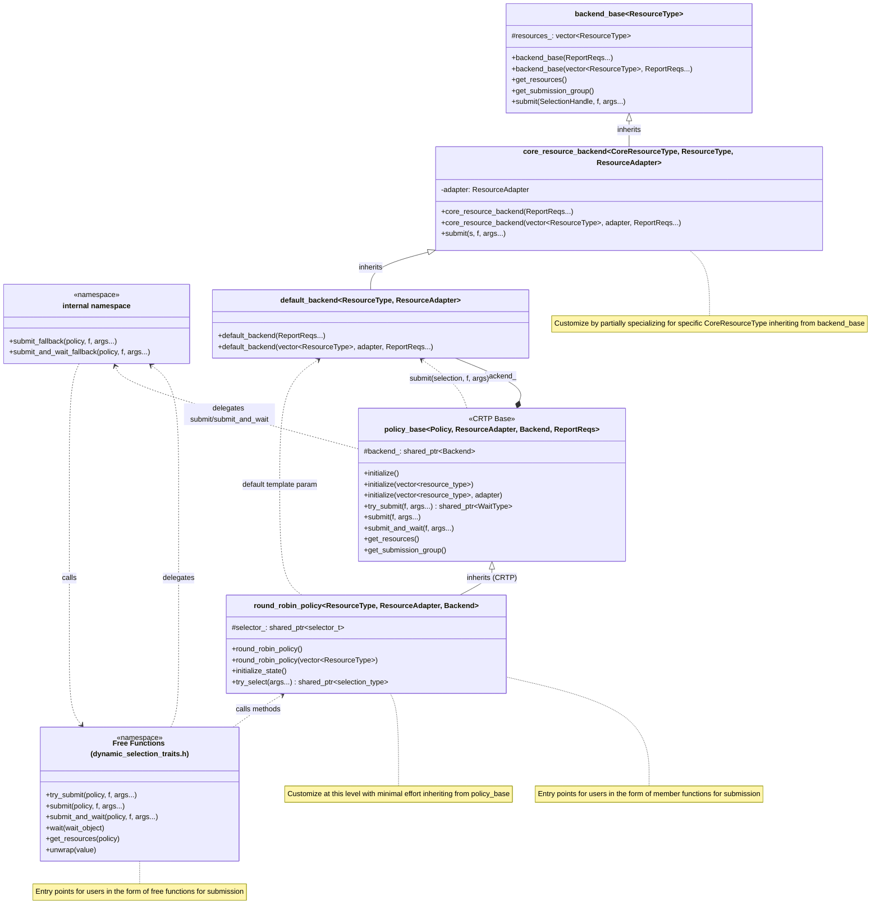

# Simplified Customization for Dynamic Selection

Dynamic Selection is a Technology Preview feature 
[documented in the oneDPL Developer Guide](https://www.intel.com/content/www/us/en/docs/onedpl/developer-guide/2022-8/dynamic-selection-api.html)
and its current design is described by 
[an experimental RFC](https://github.com/uxlfoundation/oneDPL/tree/main/rfcs/experimental/dynamic_selection).
When applying Dynamic Selection to use cases, there is often the desire to add new
backends or new selection policies. While it is possible to add new policies or backends
by following the contract described in the current design, the process is non-trivial
and requires some (unnecessarily) verbose code.

## Proposed Customization Solutions

This RFC presents two complementary proposals to simplify Dynamic Selection customization:

### Backend Customization

When applying Dynamic Selection, there is often the desire to add a new backend for
different resource types. With sensible defaults, this proposal aims to simplify
backend writing to open up Dynamic Selection to more use cases. The approach presents a flexible
backend system based on a `backend_base` template class and a `core_resource_backend` template that
can be used for simple resource types with policies which don't have reporting requirements.
For more complex resources or to serve policies with reporting requirements, specialization of
`core_resource_backend` is required.

For detailed information about backend customization, see [Custom Backends](custom_backends.md).

### Policy Customization

There is also the expectation that new selection policies will be implemented. This proposal
aims to simplify policy writing by providing a base class that handles the common functionality.
The approach presents a flexible policy system based on a `policy_base` template class that can
be used for most selection strategies.

For detailed information about policy customization, see [Custom Policies](custom_policies.md).

### High Level Class Diagram

The following diagram shows the relationships of the helpers for customization, and the entry points for the user and for the customizer of policies and backends. This diagram shows `round_robin_policy` specifically, but the same relationship exists for other policies.

