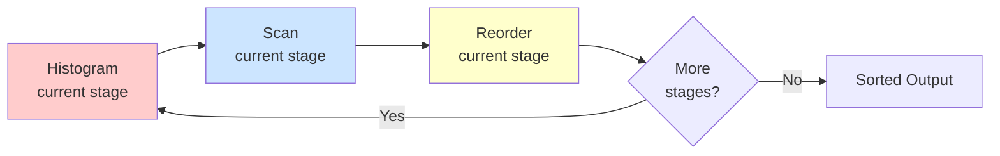
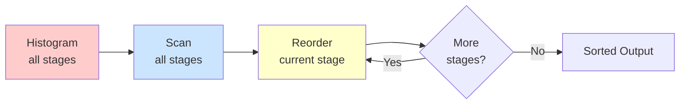
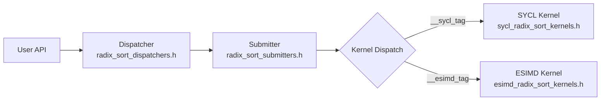

# SYCL & ESIMD GPU Radix Sort Kernel Templates

## Introduction

This RFC describes the design and implementation of GPU radix sort algorithms for oneDPL kernel templates. At the time of writing, two implementations have been provided: an initial ESIMD [[3]](#references) implementation designed for Intel's PVC (GPU Series Max) architecture and a subsequent pure SYCL implementation that generalizes the approach to Intel GPUs supporting the forward progress extension [[4]](#references).

Both implementations use the onesweep radix sort algorithm [[1]](#references) with decoupled lookback synchronization [[2]](#references), the current state-of-the-art GPU sort. This algorithmic approach addresses the global memory bandwidth bottleneck that typically limits GPU sorting performance by reducing memory traffic compared to traditional multi-pass radix sort algorithms.

The motivation for these implementations was to provide:
- Competitive performance with state-of-the-art GPU sort
- An initial ESIMD implementation (an explicit SIMD extension to SYCL) that best leverages Intel PVC architecture
- A portable pure SYCL implementation that generalizes the ESIMD approach while maintaining comparable performance across Intel Xe GPU architectures
- Integration with the oneDPL kernel templates framework, providing tunability and asynchronous execution

## Proposal

### API Overview

The implementations provide high-level sorting interfaces in the kernel templates framework. Two sorting variants are provided: `radix_sort` for keys-only sorting and `radix_sort_by_key` for sorting key-value pairs. Each of these variants provide overloads for range and iterator inputs, and for in-place and out-of-place operation.

The pure SYCL implementation defines its functions in the `oneapi::dpl::experimental::kt::gpu` namespace. The following lists function signatures for the SYCL keys-only sorting:

```cpp
namespace oneapi::dpl::experimental::kt::gpu {
    // In-place sort (range)
    template <bool IsAscending = true, uint8_t RadixBits = 8, typename KernelParam, typename KeysRange>
    sycl::event radix_sort(sycl::queue q, KeysRange&& keys, KernelParam param = {});

    // In-place sort (iterators)
    template <bool IsAscending = true, uint8_t RadixBits = 8, typename KernelParam, typename KeysIterator>
    sycl::event radix_sort(sycl::queue q, KeysIterator keys_first, KeysIterator keys_last,
                          KernelParam param = {});

    // Out-of-place sort (range)
    template <bool IsAscending = true, uint8_t RadixBits = 8, typename KernelParam,
              typename KeysInRange, typename KeysOutRange>
    sycl::event radix_sort(sycl::queue q, KeysInRange&& keys_in, KeysOutRange&& keys_out,
                          KernelParam param = {});
}
```

The `radix_sort_by_key` overloads follow the same pattern, accepting additional value range or iterator parameters. The ESIMD variants are available under `oneapi::dpl::experimental::kt::gpu::esimd` with identical signatures.

Template parameters control sort order (`IsAscending`), radix bit width (`RadixBits`), and work-group configuration (via `KernelParam`). All functions return a `sycl::event` for asynchronous execution chaining.

Unified dispatch logic in `radix_sort_dispatchers.h` and `radix_sort_submitters.h` selects the appropriate implementation and optimization path based on the input size and available hardware features.

### Kernel Parameter Constraints

The following table lists valid `kernel_param` configurations for each implementation:

| Parameter | ESIMD | SYCL |
|-----------|-------|------|
| Work-group size | 64 | 512, 1024 |
| Data per work-item | Multiples of 32 (limited by SLM capacity) | Multiples of 1 (limited by SLM capacity) |
| Radix bits | 8 | 8 |

### Usage Example

```cpp
#include <oneapi/dpl/experimental/kernel_templates>

namespace kt = oneapi::dpl::experimental::kt;

sycl::queue q;
constexpr std::size_t n = 1'000'000;

// SYCL variant: work-group size 1024, 12 elements per work-item
{
    constexpr kt::kernel_param</*data_per_workitem=*/12, /*workgroup_size=*/1024> param;
    uint32_t* keys = sycl::malloc_device<uint32_t>(n, q);
    // ... initialize keys ...
    kt::gpu::radix_sort(q, keys, keys + n, param).wait();
    sycl::free(keys, q);
}

// ESIMD variant on PVC: work-group size 64, 96 elements per work-item
{
    constexpr kt::kernel_param</*data_per_workitem=*/96, /*workgroup_size=*/64> param;
    uint32_t* keys = sycl::malloc_device<uint32_t>(n, q);
    // ... initialize keys ...
    kt::gpu::esimd::radix_sort(q, keys, keys + n, param).wait();
    sycl::free(keys, q);
}
```

### Algorithm Design

#### Onesweep Radix Sort Overview

The onesweep radix sort algorithm [[1]](#references) processes keys in a single pass per radix stage, unlike traditional radix sort implementations that use an additional input pass per radix stage. For an 8-bit radix, a 32-bit key requires 4 stages to complete the sort after an upfront histogram and scan kernel which computes radix bin offsets across all stages at once with a single pass over keys.

High-level psuedocode is shown for the onesweep implementation below:

**Histogram kernel** — computes per-bin counts across all stages in a single pass:
```
onesweep_histogram_kernel:
1.    Initialize SLM histogram with zeros
2.    for each key assigned to this work-group:
3.        Load key from global memory
4.        for each stage:
5.            Extract bin for current stage
6.            Atomic increment SLM histogram[stage][bin]
7.    Atomic fetch add global histogram with SLM histogram
```

**Scan kernel** — converts per-bin counts into global offsets:
```
onesweep_scan_kernel:
1.    Launch work-group for each stage
2.    Perform an in-place exclusive scan
```

**Onesweep reorder kernel** — executed once per radix stage:
```text
onesweep_reorder_kernel:
1.    for each tile assigned to this work-group:
2.        Load keys & values from tile
3.        Extract bins from keys
4.        Rank bins efficiently in each sub-group
5.        Scan over bin ranks across sub-groups and publish work-group total to global memory for decoupled lookback,
          prefixing tile zero's work-group total with the scanned global histogram
6.        Perform decoupled lookback to compute incoming global offsets per bin
6.        Locally reorder keys & values for this work-group into SLM
7.        Scatter keys & values from SLM to global memory using global offsets and local ranks
```

The algorithm processes data in contiguous tiles, where each work-group may handle multiple tiles. Work-groups execute concurrently and coordinate through a chained scan protocol via decoupled lookback [[2]](#references).

**Host Radix Sort Submitters** — submits the GPU kernels to compute full radix sort
```
radix_sort_impl:
1.     Submit onesweep_histogram_kernel
2.     Submit onesweep_scan_kernel
3.     for each radix stage:
4.         Submit onesweep_reorder_kernel
```

#### Decoupled Lookback

Decoupled lookback [[2]](#references) enables work-groups to communicate without device-wide barriers and avoid expensive reloading of keys from global memory with separate kernels. Each tile publishes its local histogram to global memory after computing it. Tile N then sequentially looks back at the published histograms from tiles N-1 through 0 performing an exclusive scan to determine its global offset across each radix bin. Tile 0 is prefixed with the output from the initial histogram kernel for the current stage.
Tiles may perform an early exit from the decoupled lookback once a lower indexed work-group has found and published its full incoming histogram. Prior to exiting, the tile publishes its own incoming histogram, so high indexed tiles may also early exit.

This mechanism provides two key benefits:
- Work-groups can continue processing as soon as their immediate dependencies are satisfied without waiting on others
- No global synchronization points that would stall all work-groups, freeing hardware resources for higher indexed tiles

The lookback operates by having each work-group atomically spin-wait on global memory locations until the previous work-group has written its partial histogram. Work-groups accumulate these partial results to compute their global offsets.

#### Memory Traffic and Performance Benefits

The onesweep approach, enabled by decoupled lookback, significantly reduces global memory traffic. Assuming temporary storage and decoupled lookback traffic is negligible, we can model the reduction in memory traffic as shown below:

Traditional radix sort implementations perform a new histogram and scan kernel for each stage:



The onesweep approach performs a single histogram and scan:



The table below compares the global memory traffic contributions from each kernel across all stages for a 32-bit keysort with
an 8-bit radix:

| Kernel | Traditional Radix Sort | Onesweep Radix Sort |
|--------|------------------------|---------------------|
| Histogram | 4n | n |
| Scan | $\varepsilon$ | $\varepsilon$ |
| Reorder | 8n | 8n |
| **Total memory accesses** | **12n** | **9n** |

This reduction in global memory access is critical for GPU sort performance, where global memory bandwidth is the primary bottleneck. The upfront histogram enables work-groups to determine global bin offsets without revisiting the entire dataset at each stage.

### Safety and Forward Progress Guarantees

#### The Challenge

The decoupled lookback protocol requires work-group N to spin-wait for work-group N-1 to publish its results. Without guarantees of concurrent execution, this can lead to deadlock if the hardware scheduler does not ensure that work-group N-1 makes progress while work-group N is waiting.

This is a fundamental challenge for any GPU algorithm that uses inter-work-group synchronization within a single kernel launch as current GPU programming models do not provide any work-group forward progress guarantees with standard launch modes.

#### ESIMD Approach

The ESIMD implementation relies on specific PVC hardware scheduling characteristics and memory model rather than a formal forward progress guarantee. On PVC, the hardware thread scheduler and execution unit allocation provide sufficient concurrent execution of work-groups to avoid deadlock in the lookback protocol. Empirical testing across a range of input sizes, key types, and work-group configurations was used to verify correctness and the absence of hangs.

This approach is inherently architecture-specific: the scheduling behavior that prevents deadlock on PVC is not guaranteed by the SYCL programming model and may not hold on other architectures. Any extension to new hardware would require similar empirical validation.

#### SYCL Approach

The SYCL implementation uses the oneAPI forward progress extension as a kernel launch property to guarantee safety:

```cpp
auto get(syclex::properties_tag) const
{
    return syclex::properties{
        syclex::work_group_progress<syclex::forward_progress_guarantee::concurrent,
                                    syclex::execution_scope::root_group>,
        syclex::sub_group_size<32>
    };
}
```

This extension guarantees that work-groups within the kernel launch execute concurrently and make independent forward progress. This is the only approach that provides a formal hardware safety guarantee across different GPU schedulers and vendors where the property is supported. With this launch mode only a small number of work-groups may be launched, so the onesweep kernel is modified to have each work-group process multiple tiles strided by the grid size.

The forward progress extension provides a principled solution that is supported by the oneAPI DPC++ compiler and guarantees correct behavior.

### Unified Design Architecture

The ESIMD and SYCL implementations share a unified code structure using tag-based dispatch. A compile-time tag (`__esimd_tag` or `__sycl_tag`) selects the appropriate implementation path through three main components: dispatcher, submitter, and kernel. The dispatcher handles high-level decision logic (problem size, optimization selection), the submitter manages kernel launches and memory orchestration, and the kernel contains the actual sort implementation. This design eliminates code duplication while allowing backend-specific optimizations at each layer. The following diagram shows the generalized dispatch logic for the unified implementation:



### Platform Support

The ESIMD implementation is limited to Intel PVC architecture with a work-group size of 64 and data per work item multiple of 32. The SYCL implementation has been tested on Intel PVC and BMG with work-group sizes of 512 and 1024, requires forward progress extension support, and is expected to work on future Intel GPU architectures supporting the extension.

### Implementation Status

**ESIMD Implementation:**
The ESIMD implementation provides a complete onesweep multi-work-group kernel. It includes a one-work-group optimization for small inputs where the problem size is less than or equal to `workgroup_size × data_per_work_item`. This optimization avoids the lookback synchronization overhead for cases that fit within a single work-group's SLM capacity. The implementation supports both keys-only sorting and key-value pair sorting.

**SYCL Implementation:**
The SYCL implementation provides an onesweep multi-work-group kernel using sub-group primitives for portability. It supports both keys-only sorting and key-value pair sorting. The one-work-group optimization remains an open topic for future work.

Both implementations use an 8-bit radix, resulting in 256 bins per stage.

### Testing

Correctness is validated through a unified test structure that executes across all supported configurations. Tests verify sorting correctness for random, sorted, reverse-sorted, and pathological input distributions.

| Variant | Work-Group Size | Data Per Work-Item | Key Types | Test Variants |
|---------|-----------------|--------------------|-----------| ------------- |
| ESIMD   | 64              | 32-512 (step 32)   | char, uint16_t, int, uint64_t, float, double | In-place, out-of-place, by-key |
| SYCL    | 512, 1024       | 1-16               | char, uint16_t, int, uint64_t, float, double | In-place, out-of-place, by-key |

## Alternatives Considered

### Atomic Counter for Tile Ordering

An alternative approach using atomic counters was evaluated but rejected for the SYCL forward progress problem. In this approach, each work-group would increment a global atomic counter to receive a sequential tile ID, and lookback would use this ordering instead of their work-group identifier, relying on the assumption that once the atomic counter was incremented the work-group would continue to make progress. This could potentially handle cases where work-groups execute out of dispatch order.

However, this approach has limitations:
- It does not provide a formal guarantee of safety and requires empirical testing and potential algorithmic adjustments when supporting new architectures
- During evaluation, hardware hangs were observed on certain hardware configurations that were not easily ameliorated, highlighting the difficulty of ensuring correctness without formal guarantees
- It relies on scheduler behavior when multiple kernels are concurrently executing that is unspecified by the SYCL programming model

## Open Questions

In addition to the open questions for kernel templates in general, the following areas remain open for future investigation and development:

**Radix bit width:** The current implementations use an 8-bit radix (256 bins). Exploring support for other radix widths (e.g., 4 or 6 bits) could improve performance for different key distributions and hardware characteristics. Larger radix widths reduce the number of stages but increase SLM and register file usage. 

**Single work-group kernel template:** The one-work-group optimization is currently embedded within the dispatch logic for ESIMD. Providing a separate kernel template API specifically for single work-group sorting would enable explicit control and specialization for small-data use cases.

**Large input support:** The current implementations use bit masks that limit input sizes to 2^30 elements (approximately 1 billion elements for 4-byte keys). Extending support to larger inputs would require addressing the mask limitations in the offset calculations and histogram data structures.

**Work-group size flexibility:** The SYCL implementation currently supports work-group sizes of 512 and 1024. Supporting more work-group size configurations (e.g. multiples of 128) would enable flexible tuning for different hardware and problem sizes.

## Exit Criteria

The exit criteria for this feature align with the [kernel templates exit criteria](../kernel_templates/README.md#exit-criteria) in addition to addressing the above open questions.

## References

1. A. Adinets and D. Merrill, "Onesweep: A Faster Least Significant Digit Radix Sort for GPUs," 2022. Available: https://arxiv.org/abs/2206.01784
2. D. Merrill and M. Garland, "Single-pass Parallel Prefix Scan with Decoupled Look-back," 2016. Available: https://research.nvidia.com/publication/2016-03_single-pass-parallel-prefix-scan-decoupled-look-back
3. "Explicit SIMD SYCL extension (ESIMD)," Intel LLVM SYCL Extensions. Available: https://github.com/intel/llvm/blob/sycl/sycl/doc/extensions/supported/sycl_ext_intel_esimd/sycl_ext_intel_esimd.md
4. "Forward Progress Guarantees Extension," Intel LLVM SYCL Extensions. Available: https://github.com/intel/llvm/blob/sycl/sycl/doc/extensions/experimental/sycl_ext_oneapi_forward_progress.asciidoc

