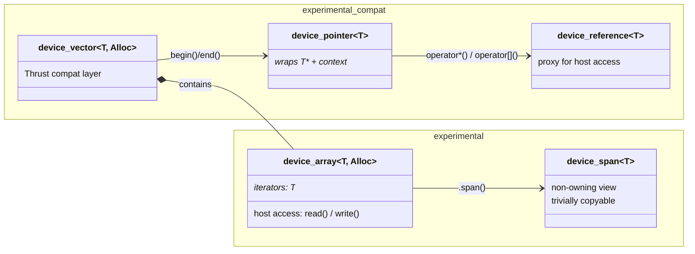

# `device_array` and `compat::device_vector` for oneDPL

## Introduction

This RFC proposes adding a container to oneDPL that provides
a `std::vector`-like interface for managing device memory.

### Motivation

- **Migration from CUDA/Thrust** - Thrust's `device_vector` is heavily used
  in CUDA codebases. Providing an equivalent in oneDPL lowers the barrier
  for porting to SYCL backends. SYCLomatic already generates code targeting
  a `dpct::device_vector` compatibility shim, and having an official oneDPL
  type would give that migration a stable target, in a repository which is
  actively maintained.
- **Ease of use** - Users currently must manually manage USM allocations or
  SYCL buffers and pair them with raw pointers or iterators. A
  `device_vector` encapsulates allocation, sizing, and lifetime in a
  single object and integrates directly with oneDPL algorithms.
- **Real-world usage patterns** - A [detailed survey](usage_pattern_study.md)
  Key findings:

  1. **Construction + bulk transfer + raw pointer extraction** are the core
     operations across all domains. `device_vector` is primarily used as an
     RAII device memory manager and host-device data shuttle.
  2. **`begin()`/`end()` integration with parallel algorithms** is the
     second-most critical capability.
  3. **Some popular AI/ML projects** (FAISS, cuDF, cuML) have **moved away from 
     `thrust::device_vector`** due to unwanted value initialization, lack of
     stream parameters, and header bloat — then built alternatives that
     prioritize explicit async control and uninitialized allocation. Other HPC
     and ML projects remain heavy users.
  4. **Full `std::vector`-like modifiers** (`push_back`, `insert`, `erase`)
     are rarely used in real workloads.

## Comparison of Existing device_vector Implementations

| Implementation | Source |
|---|---|
| **Thrust** (`thrust::device_vector`) | [NVIDIA/cccl - device_vector.h](https://github.com/NVIDIA/cccl/blob/main/thrust/thrust/device_vector.h) |
| **SYCLomatic** (`dpct::device_vector`) | [SYCLomatic - vector.h](https://github.com/oneapi-src/SYCLomatic/blob/SYCLomatic/clang/runtime/dpct-rt/include/dpct/dpl_extras/vector.h) |
| **Distributed Ranges** (`dr::sp::device_vector`) | [distributed-ranges - device_vector.hpp](https://github.com/oneapi-src/distributed-ranges/blob/main/include/dr/sp/device_vector.hpp) |
| **sycl-thrust** (`thrust::device_vector`) | [SparseBLAS/sycl-thrust - device_vector.h](https://github.com/SparseBLAS/sycl-thrust/blob/main/include/thrust/device_vector.h) |

### How They Differ

| Aspect | Proposed (oneDPL) | Thrust | sycl-thrust | SYCLomatic |
|---|---|---|---|---|
| **Default Allocator** | `device_allocator<T>` wrapping `sycl::malloc_device`; custom `DeviceAllocator` concept | `thrust::device_allocator<T>` (CUDA `cudaMalloc`) | `device_allocator<T>` (`sycl::malloc_device`); supports alignment template parameter | USM: `sycl::usm_allocator<T, shared>` / Buffer: `__buffer_allocator<T>` |
| **Memory Model** | **Device memory** via `sycl::malloc_device`; host access triggers explicit transfers | **Device memory** via `cudaMalloc`; host access triggers explicit transfers | **Device memory** via `sycl::malloc_device`; explicit transfers | **Shared memory** via USM shared or SYCL buffer/accessor; runtime manages placement |
| **Host Element Access** | `device_array`: explicit `read()`/`write()`; compat `device_vector`: `device_reference` proxy | Via `device_reference` proxy (explicit device-to-host copy) | Via `device_reference` proxy (`__SYCL_DEVICE_ONLY__` bifurcation) | Via `device_reference` proxy (runtime-managed migration) |
| **std::vector Interop** | Explicit constructor + `to_vector()` | Copy constructors from/to `std::vector` | Constructor from `std::vector` | Copy/move + implicit `operator std::vector()` |
| **Queue Association** | Stores context + device; queue provided per-operation or created on demand | Implicit (CUDA stream) | Allocator stores `device` + `context`; queue resolved at runtime via pointer introspection | Global default queue |
| **Uninitialized Construction** | `device_array`: uninitialized by default; compat `device_vector`: `no_init_t` tag | `default_init_t`, `no_init_t` tags | Not supported | Not supported |

## Proposal

The proposal consists of two complementary types that share an underlying
implementation:

1. **[`device_array<T, Alloc>`](device_array.md)** — the primary API.
   A clean, explicit container for device memory with no proxy types. Raw `T*`
   iterators, explicit `read()`/`write()` for host access, uninitialized by
   default, and range support via `device_span`.

2. **[`compat::device_vector<T, Alloc>`](device_vector_compat.md)** — a
   Thrust compatibility layer built on `device_array`. Adds `device_pointer`,
   `device_reference`, and `operator[]` proxy semantics for drop-in migration
   from `thrust::device_vector`.

### Class Relationships

### Design Decisions

- **Use USM device memory as baseline, copy to/from host on demand when required.**
   This matches semantics of all pre-existing implementations other than SYCLomatic
   where the runtime handles where memory lives. Shared memory has significantly
   worse performance than device memory, and if users want those semantics, they
   can directly use usm shared memory or sycl buffers.

- **Store context, not queue.** `sycl::malloc_device` requires only
  a context (and a device which can be looked up with the pointer). Storing a queue would tie the container to a particular
  queue and imply synchronization semantics. Queues are accepted per-operation
  or created on demand.

- **Type T should only require device copyability.**
  We should not need anything except device copyability (for copy to and from
  the device).

- **No tag system for dispatch to specific hardware.**
  Execution policies dictate where algorithms are run. We don't intend to
  provide other flavors of vector / iterator which would have different tags,
  which would be required to dispatch based upon tag.

- **Custom `DeviceAllocator` concept for pluggable allocation.**
  A minimal allocator interface — just `allocate(n, ctx, dev)` and
  `deallocate(p, n, ctx, dev)` — that avoids the `std::allocator` named
  requirements (which mandate host-accessible memory). Enables pool allocators,
  aligned allocation, and other strategies. See the
  [device_array allocator section](device_array.md#allocator) for details.

- **No `push_back`, `insert`, `erase`.**
  Rarely used in practice (see [usage study](usage_pattern_study.md)),
  high implementation complexity for device memory.

- **Host-side operations block but do not synchronize with prior work.**
  The user is responsible for ensuring prior kernels have completed before
  host-side access. This can be achieved via an in-order queue or explicit
  event waits. `device_array` additionally offers async overloads with
  `depends_on` events.

## Open Questions

- **Should `device_array`'s async overloads be in the initial release or
  deferred?**
  see [device_array](device_array.md).

- **Header organization?** 
  - We could have a `<oneapi/dpl/compat>` header and automatically include `device_array` with other includes?
  Alternatives:
  - Individual headers:
  `<oneapi/dpl/device_array>` and `<oneapi/dpl/device_vector>`.. `device_vector`
  would transitively include `device_array` since it depends on it.
  - We could have a `compat` header and a individual `device_array` header. However, if we intend to use `device_array` within our own sycl implementations, that may impact our decision here.

- **Compatibility namespace naming?** This proposal places the
  Thrust-compatible types in `oneapi::dpl::experimental::compat`. Several
  aspects are worth discussing:
  - Should `compat` be nested under `experimental`, or should it be
    `oneapi::dpl::compat` directly? Or alternatively `oneapi::dpl::ext::compat`.
  - Is `compat` the right name? Alternatives: `thrust_compat`, `migration`,
    `legacy`. `compat` is concise but doesn't indicate what it's compatible
    *with*. `thrust_compat` is more explicit but ties the namespace to a
    specific vendor's API.
  - Moreover, is this repository where we want the compatibility headers?  I think yes, otherwise they will be too cumbersome to use, but it worth raising.

