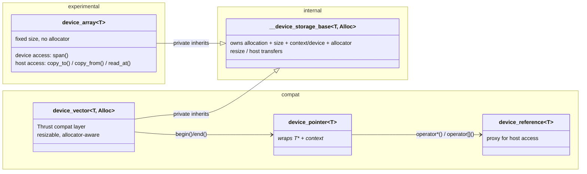

# `device_array` and `compat::device_vector` for oneDPL

## Introduction

This RFC proposes adding data containers to oneDPL for managing device memory and data transfer.

### Motivation

- **Migration from CUDA/Thrust** - Thrust's `device_vector` is heavily used
  in CUDA codebases. Providing an equivalent in oneDPL lowers the barrier
  for porting to SYCL backends. SYCLomatic already generates code targeting
  a `dpct::device_vector` compatibility shim, and having an official oneDPL
  type would give that migration a stable target, in a repository which is
  actively maintained.
- **Ease of use** - Users currently must manually manage USM allocations or
  SYCL buffers and pair them with raw pointers or iterators. A
  device container encapsulates allocation, sizing, and lifetime in a
  single object and integrates directly with oneDPL algorithms.
- **Real-world usage patterns** - A [detailed survey](usage_pattern_study.md)
  of real-world usage informed the design. Key findings:

  1. **Construction + bulk transfer + raw pointer extraction** are the core
     operations across all domains. `device_vector` is primarily used as an
     RAII device memory manager and host-device data shuttle.
  2. **`begin()`/`end()` integration with parallel algorithms** is the
     second-most critical capability.
  3. **Some popular AI/ML projects** (FAISS, cuDF, cuML) have **moved away from
     `thrust::device_vector`** due to unwanted value initialization, lack of
     stream parameters, and header bloat — then built alternatives that
     prioritize explicit async control and uninitialized allocation. Other HPC
     and ML projects remain heavy users.
  4. **Full `std::vector`-like modifiers** (`push_back`, `insert`, `erase`)
     are rarely used in real workloads.

## Comparison of Existing device_vector Implementations

| Implementation | Source |
|---|---|
| **Thrust** (`thrust::device_vector`) | [NVIDIA/cccl - device_vector.h](https://github.com/NVIDIA/cccl/blob/main/thrust/thrust/device_vector.h) |
| **SYCLomatic** (`dpct::device_vector`) | [SYCLomatic - vector.h](https://github.com/oneapi-src/SYCLomatic/blob/SYCLomatic/clang/runtime/dpct-rt/include/dpct/dpl_extras/vector.h) |
| **sycl-thrust** (`thrust::device_vector`) | [SparseBLAS/sycl-thrust - device_vector.h](https://github.com/SparseBLAS/sycl-thrust/blob/main/include/thrust/device_vector.h) |

### How They Differ

| Aspect | Proposed (oneDPL) | Thrust | sycl-thrust | SYCLomatic |
|---|---|---|---|---|
| **Default Allocator** | `device_allocator<T, Alignment>` wrapping `sycl::malloc_device`; custom `DeviceAllocator` concept | `thrust::device_allocator<T>` (CUDA `cudaMalloc`) | `device_allocator<T>` (`sycl::malloc_device`); supports alignment template parameter | USM: `sycl::usm_allocator<T, shared>` / Buffer: `__buffer_allocator<T>` |
| **Memory Model** | **Device memory** via `sycl::malloc_device`; host access triggers implicit transfers | **Device memory** via `cudaMalloc`; host access triggers implicit transfers | **Device memory** via `sycl::malloc_device`; implicit transfers | **Shared memory** via USM shared or SYCL buffer/accessor; runtime manages placement |
| **Host Element Access** | `device_array`: explicit transfer to host; compat `device_vector`: `device_reference` proxy | Via `device_reference` proxy (explicit device-to-host copy) | Via `device_reference` proxy (`__SYCL_DEVICE_ONLY__` bifurcation) | Via `device_reference` proxy (runtime-managed migration) |
| **std::vector Interop** | Explicit constructor + `to_vector()` | Copy constructors from/to `std::vector` | Constructor from `std::vector` | Copy/move + implicit `operator std::vector()` |
| **Queue Association** | Stores context + device; queue provided per-operation or created on demand | Implicit (CUDA stream) | Allocator stores `device` + `context`; queue resolved at runtime via pointer introspection | Global default queue |
| **Uninitialized Construction** | `device_array`: uninitialized by default; compat `device_vector`: `no_init_t` tag | `default_init_t`, `no_init_t` tags | Not supported | Not supported |

## Proposal

The proposal consists of two complementary public types that share a
non-public base implementation, `internal::__device_storage_base`:

1. **[`device_array<T>`](device_array.md)** — the primary API.
   A clean, explicit, **fixed-size** container for device memory with no proxy
   types. Explicit methods for host access or transfer, uninitialized by
   default, and device iteration and range support via `oneapi::dpl::span` from `span()`.
   It surfaces a deliberately minimal interface: no allocator access, and no
   resizing.

2. **[`compat::device_vector<T, Alloc>`](device_vector_compat.md)** — a
   Thrust compatibility layer. Adds `device_pointer`, `device_reference`, and
   `operator[]` proxy semantics for drop-in migration from
   `thrust::device_vector`, along with a resizable, allocator-aware interface.

Both types **privately inherit** from
`internal::__device_storage_base<T, Alloc>`, which owns the shared machinery:
the device allocation and its lifetime, size, associated `sycl::context` /
`sycl::device`, the allocator instance, resizing, and the host-device transfer
helpers. Each derived type re-exposes (via `using` declarations) only the
subset of the base appropriate to its public contract — `device_array` omits
the allocator and resizing entirely, while `compat::device_vector` re-exposes
the full surface. This lets `device_array` present a simplified interface
without duplicating the implementation that `device_vector` reuses.

### Class Relationships

```mermaid
classDiagram
    direction LR

    namespace internal {
        class __device_storage_base~T, Alloc~ {
            owns allocation + size + context/device + allocator
            resize / host transfers
        }
    }

    namespace experimental {
        class device_array~T~ {
            fixed size, no allocator
            device access: span()
            host access: copy_to() / copy_from() / read_at()
        }
    }

    namespace compat {
        class device_vector~T, Alloc~ {
            Thrust compat layer
            resizable, allocator-aware
        }

        class device_pointer~T~ {
            wraps T* + context*
        }

        class device_reference~T~ {
            proxy for host access
        }
    }

    device_array --|> __device_storage_base : private inherits
    device_vector --|> __device_storage_base : private inherits
    device_vector --> device_pointer : begin()/end()
    device_pointer --> device_reference : operator*() / operator[]()
```

### Design Decisions

- **Use USM device memory as baseline, copy to/from host on demand when required.**
   This matches semantics of all pre-existing implementations other than SYCLomatic
   where the runtime handles where memory lives. Shared memory has significantly
   worse performance than device memory, and if users want those semantics, they
   can directly use usm shared memory or sycl buffers.

- **Store context, not queue.** `sycl::malloc_device` requires only
  a context (and a device which can be looked up with the pointer). Storing a queue would tie the container to a particular
  queue and imply synchronization semantics. Queues are accepted per-operation
  or created on demand.

- **Type T should only require device copyability.**
  We should not need anything except device copyability (for copy to and from
  the device).

- **No tag system for dispatch to specific hardware.**
  Execution policies dictate where algorithms are run. We don't intend to
  provide other flavors of vector / iterator which would have different tags,
  which would be required to dispatch based upon tag.

- **Custom `DeviceAllocator` concept for pluggable allocation.**
  A minimal allocator interface — just `allocate(n)` and `deallocate(p, n)` — that avoids
  the `std::allocator` named requirements (which mandate host-accessible memory). Enables
  pool allocators, aligned allocation, and other strategies. The allocator is
  stateful, carrying the `sycl::context`, `sycl::device` and `sycl::property_list` to
  allocate against, mirroring `sycl::usm_allocator`; that is why `allocate()` needs only
  an element count. The allocator is a template
  parameter of `compat::device_vector` (and the shared base); `device_array`
  hardcodes the default `device_allocator<T>` and does not expose it. See the
  [device_vector allocator section](device_vector_compat.md#allocator) for
  details.

- **`oneapi::dpl::span` alias rather than `sycl::span` directly.**
  Spans appear in the public interface (`span()`, `copy_to`, `copy_from`), so we
  alias `std::span` when `__cpp_lib_span >= 202002L` and fall back to
  `sycl::span` otherwise. Both are device copyable per SYCL 2020 §3.13.1, but
  preferring the standard type where it exists lets these spans compose with
  users' C++20 code and `std::ranges` without conversion. See
  [device_array](device_array.md#oneapidplspan).

- **No `push_back`, `insert`, `erase`.**
  Rarely used in practice (see [usage study](usage_pattern_study.md)),
  high implementation complexity for device memory.

- **Host-side operations block but do not synchronize with prior work.**
  The user is responsible for ensuring prior kernels have completed before
  host-side access. This can be achieved via an in-order queue or explicit
  event waits. No asynchronous overloads are proposed for either type; see
  [device_array](device_array.md#resolved-questions).

- **Header organization** - use individual headers
  <oneapi/dpl/experimental/device_array>, <oneapi/dpl/compat/device_vector>, we may add
  <oneapi/dpl/compat> in the future. This matches convention of the standard library and
  thrust.

- **Namespace** - device_array should be in `oneapi::dpl::experimental::device_array`.
  The intention for `device_vector` is to add it `oneapi::dpl::compat` directly without `experimental`.
  This means we must be very careful with the initial implementation of
  `device_vector` as a breaking change here is a breaking change for oneDPL as a
  whole.

