# Storage Utilities for SYCL Backend Patterns in oneDPL

## Overview

The storage utilities provide a structured way to manage device and host memory
for SYCL backend patterns in oneDPL. They abstract over two underlying memory
backends — SYCL Unified Shared Memory (USM) and `sycl::buffer` — and handle
allocation, kernel access, result retrieval, and lifetime management in a
uniform way.

The utilities are defined in `namespace oneapi::dpl::__par_backend_hetero`.
Internal implementation details live in the nested
`namespace oneapi::dpl::__par_backend_hetero::__internal`.

The central design principle is a clean separation between the storage objects
that are created and used within a backend pattern, and the holder object that
owns the memory after the pattern completes. The holder is created by a caller
and outlives the pattern, carrying the results back to the caller.

```mermaid
flowchart TB
    subgraph CallerStart["Algorithm"]
        S1["Construct holder\n__parallel_pattern_holder&lt;N, Ts...&gt; __holder(__q)"]
        S2["Call a backend pattern\n__parallel_pattern_name(..., __holder, ...)"]

        subgraph BackendPattern["Backend Pattern"]
            BP1["Defines a holder alias\nusing __parallel_pattern_holder =\n__storage_holder&lt;NScratch, ResultTypes...&gt;"]
            BP2["Construct storage\n__device_storage&lt;T&gt;,\n__result_storage&lt;T&gt; or\n__combined_storage&lt;T&gt;"]
            BP3["Submit kernel(s)"]

            subgraph KernelSubmitter["Kernel Submitter"]
                KS1["Submit kernel\n__q.submit([&](sycl::handler& __cgh){...})"]
                KS2["Acquire accessor(s)\n__get_accessor(__mode, __storage, __cgh)\n__get_result_accessor(__mode, __storage, __cgh)"]
                KS3["Use storage in kernel\nauto* __ptr = __acc.__data()"]
                KS1 --> KS2 --> KS3
            end

            BP4["Transfer storage ownership\n__holder.__store&lt;Idx&gt;(std::move(__storage))\n__holder.__store_scratch(std::move(__storage))"]
            BP5["Return sycl::event"]

            BP3 -- "__storage&" --> KS1
            KS3 -- "sycl::event" --> BP4
            BP2 --> BP3
            BP4 --> BP5
        end

        FA3["Package result into\n__future{__event, std::move(__holder).__extract()}"]
        FS3["__event.wait_and_throw()"]
        FS4["Read result\n__holder.__copy_result&lt;Idx&gt;(__dst, __n)\nor __get_results(__holder)"]

        S1 -.- |uses the alias| BP1
        S1 --> S2
        FS3 --> FS4
        S2 -- "__storage_holder&" --> BP2
        BP5 -- "if sync" --> FS3
        BP5 -- "if async" --> FA3
    end
```



## Storage Types

Three storage types are provided, all built on a common base. Each type
allocates memory at construction time and releases it when destroyed.
Usually though ownership of the memory is transferred to a `__storage_holder`.

### `__device_storage<T>`

The base storage type for temporary scratch data. On construction it attempts
to allocate device USM; if the device does not support device USM allocations,
it falls back to a `sycl::buffer<T, 1>`.

`__device_storage` is used when a backend pattern needs intermediate working
memory for its kernels. It is also the base class for `__result_storage` and
`__combined_storage`.

### `__result_storage<T>`

A storage type for a single result value or a small array returned to the host.
The result type `T` must satisfy `sycl::is_device_copyable_v<T>`.

On construction it first attempts to allocate host USM, which allows the result
to be read back to the host without an explicit copy. If host USM is not
available, it falls back to the device USM or `sycl::buffer` strategy of
`__device_storage`. 

After the kernel completes, the result can be retrieved via `__copy_result`:
```cpp
_T __value{};
__result.__copy_result(&__value, 1);
```

#### `__create_result_storage_opt` function

A helper function template that conditionally creates a `__result_storage<T>`
or a `__no_storage_tag` sentinel at compile time:
```cpp
auto __opt_result = __create_result_storage_opt<_Condition, _T>(__q, __n);
// __opt_result is __result_storage<_T> if _Condition, else __no_storage_tag
```

This is useful in backend patterns that are parameterized over whether a result
is needed or not, such as for iteration stop position if the output is bounded.
When `_Condition` is `false`, no allocation is performed. The returned
`__no_storage_tag` still can be passed to `__get_accessor`;
see [Acquiring Accessors](#acquiring-accessors) for important additional details.

### `__combined_storage<T>`

A storage type that holds both scratch data and a result of the same type.
The type `T` must satisfy `sycl::is_device_copyable_v<T>`.

When host USM is available, the result is placed in a host USM buffer
and the scratch data in a separate device-side allocation.
Otherwise, a single device USM or `sycl::buffer` allocation is used,
with the scratch region at the start and the result region immediately following.
To access the scratch and result regions, two distinct accessors are used
(see [Acquiring Accessors](#acquiring-accessors)).

After the kernel completes, the result can be retrieved via `__copy_result`
the same way as with `__result_storage`.

`__combined_storage` is preferred over a pair of `__device_storage` and
`__result_storage` when the scratch and result data have the same type,
as this allows to optimize storage allocation if host USM is not available.

### Acquiring Accessors

To access the data in a storage, an accessor is acquired inside the lambda
passed to `sycl_queue.submit`. Two free functions are provided (where `cgh`
is the `sycl::handler` instance within the lambda):

- `__get_accessor(access_mode_tag, storage, cgh, property_list)` —
  acquires an accessor to the data storage region, or to the scratch-only
  region for `__combined_storage`.
- `__get_result_accessor(access_mode_tag, storage, cgh, property_list)` —
  acquires an accessor to the result region of a `__combined_storage`.

Both functions return a `__combi_accessor<T, AccessMode>`, which provides a
uniform data access interface regardless of whether the underlying storage is USM
or `sycl::buffer`. Inside the kernel, the raw `T*` pointer to the data (`const T*`
if the storage is accessed only for read) is obtained by calling `__data()`
on the accessor. The result should be cached in a local variable at the start
of the kernel, as `__data()` may involve an accessor dereference.

```cpp
__q.submit([&](sycl::handler& __cgh) {
    auto __scratch_acc = __get_accessor(sycl::read_write, __scratch_and_result, __cgh);
    auto __result_acc  = __get_result_accessor(sycl::write_only, __scratch_and_result,
                                               __cgh, __dpl_sycl::__no_init{});
    __cgh.parallel_for<_KernelName>(__range, [=](sycl::nd_item<1> __item) {
        auto* __scratch_ptr = __scratch_acc.__data();
        auto* __result_ptr  = __result_acc.__data();
        // use __scratch_ptr and __result_ptr
    });
});
```

`__get_accessor` also accepts a `__no_storage_tag` in place of a storage object,
in which case it returns a `__no_storage_tag` without any side effects.
This allows backend patterns to be written generically, whether a result storage
is needed or not. Using an accessor to an optional result storage must be guarded
by the same compile-time condition used for storage creation or by
`__is_combi_accessor(accessor)`.
